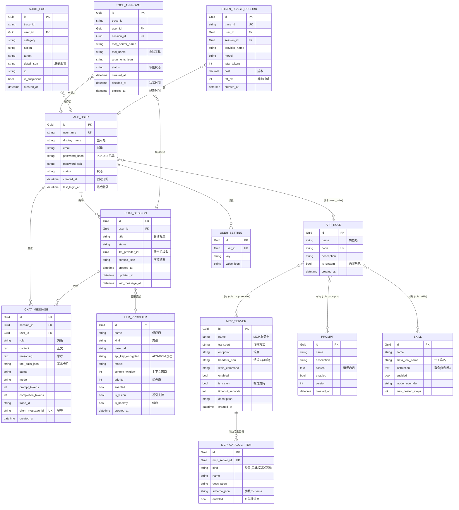
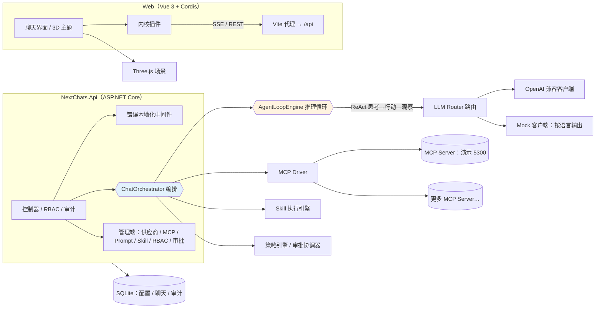
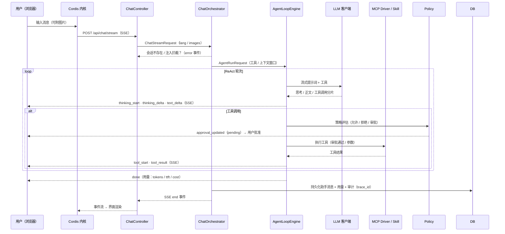
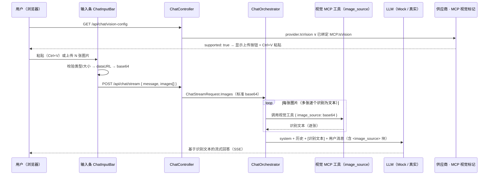

# Next Chats

> [**English README**](./README.md)

基于 **DeepSeek Harness 原理** 的 B/S 多模态 AI 聊天平台：LLM + MCP（Model Context Protocol）+ Skill 插件化编排，前端由 **Cordis** 插件内核驱动 Three.js 轻量 3D 界面。

> 参照论文：*A Programming Paradigm for Spatiotemporal Composability* —— 一切皆插件，由 Cordis 驱动。

**多语言界面**：中文（简体）与 English 双语，默认英文；右上角 🌐 一键切换，选择保存在 `localStorage` 自动记住。

---

## 架构与流程（MERMAID）

### 数据模型（ER 图）



### 系统架构



### 聊天（ReAct）流程 —— SSE 流式



### 图片 / 视觉流程（image_source 标准 base64）



## 技术栈

| 层 | 技术 |
| --- | --- |
| 后端 | .NET 10 · ASP.NET Core · EF Core（现 SQLite → 可切 MySQL 8）|
| MCP | **ModelContextProtocol SDK 2.2.0**（最新稳定版）· Streamable HTTP 传输 · STDIO 可扩展 |
| 前端 | Vue 3 · TypeScript · Vite · Element Plus · Three.js · **Cordis ^3.18.1**（插件内核）|
| 安全 | JWT · PBKDF2-SHA256(210k) 密码 · AES-256-GCM 密钥加密 · 审计日志脱敏 |
| 国际化 | vue-i18n 10（中英双语，默认英文）· 后端错误经 `X-Lang` 请求头本地化 |

## 目录结构

```
next-chats/
├── src/
│   ├── NextChats.Core/           # 领域模型、编排层、引擎、驱动（可移植，无 ASP.NET 依赖）
│   ├── NextChats.Infrastructure/ # EF Core 数据 + 缓存 + 安全服务（可替换实现）
│   └── NextChats.Api/            # Web API（SSE 流、管理端、RBAC、审计、指标、i18n）
├── samples/McpDemoServer/        # 演示 MCP Server（Streamable HTTP）
└── web/                          # Vue 3 + Cordis 前端
    ├── src/i18n/                 # en / zh 分域语言包
    └── scripts/smoke*.mjs        # 端到端冒烟脚本（Node fetch 流式读取）
```

## 快速开始

```bash
# 1. 启动演示 MCP Server（端口 5300）
dotnet run --project samples/McpDemoServer -c Debug

# 2. 启动 API（端口 5210；首次启动自动建库 + 种子数据）
dotnet run --project src/NextChats.Api -c Debug

# 3. 启动前端（Vite 代理 /api → 5210）
cd web && npm install && npm run dev
# 打开 http://localhost:5173 （种子管理员：admin / admin123）
```

## 核心设计

### 编排层（Core）
- **有效交集工具集**：`角色绑定 ∩ 用户启用 ∩ MCP 全局启用` 取交集，逐用户隔离。
- **活跃 Skill 匹配**：Skill 以「元工具」形式暴露给模型（`skill_<slug>`），指令按需懒加载，避免 token 爆炸。
- **Prompt 构建**：模板引擎（`{{var}}` / `#if` / `#each` / `#section`）渲染系统提示。
- **ReAct 循环（AgentLoopEngine）**：生产者-消费者 Channel 架构；LLM 流式事件与循环主流程解耦，可安全中断。

### 引擎（Core）
- **LLM Router**：多供应商优先级 + 轮询 + 故障转移（mark-unhealthy 熔断），OpenAI 兼容 / Mock 双客户端。
- **MCP 驱动**：严格最新 MCP 规范（引用 [MCP 2026-07 修订](https://blog.modelcontextprotocol.io/posts/2026-07-28/)）；连接池复用；调用重试（指数退避）；
  **MCP 错误进循环** —— 工具错误作为工具结果回灌给模型用于重试/解释，会话绝不因此中断。
- **策略引擎**：`Allow → Deny → RequireApproval` 三级裁决 + 危险操作符号名启发式（如 `delete_all`）；审批支持 pending/approved/rejected/expired。
- **上下文管理**：token 估算 → 压缩（LLM 摘要）→ 截断，绝不超过模型长度上限，全程不中断会话。

### 服务端统一配置（管理端）
- LLM 供应商（启用开关 / model / endpoint / api-key 加密 / temperature / context-window）
- MCP 服务器（Name / Endpoint / Headers JSON 加密保存；**「获取」自动带出** tools/prompts/resources 并以 Schema 落库；逐项禁用）
- Prompt 多套、Skill 多套（可插拔懒加载）
- RBAC：用户 / 角色；角色 ↔ MCP / Prompt / Skill 绑定

### 可观测性与成本
- `trace_id`（`trc_...`）贯穿 Orchestration / LLM / MCP / 审计；token 进出统计；指标：TTFT、tokens、cost、工具时延、审批数（`/api/admin/metrics/usage`）。
- 幂等写入：（UserId, ClientMessageId）唯一键；关键聊天日志持久化，重启不丢消息。

### 日志三通道
- **给用户**：友好文案 + 错误码（无 stack / endpoint / header）
- **给模型**：工具错误作为 tool result 回灌（可重试、可解释）
- **给日志**：完整上下文（含脱敏后的）

## 国际化
- 前端：`vue-i18n`，语言包按域拆分于 `web/src/i18n/locales/{en,zh}/`，默认英文。
- 后端：所有用户可见文案集中在单一字典 `src/NextChats.Core/Localization/Texts.cs`（中英双语），代码中不再硬编码界面文案；错误响应经 `X-Lang` 请求头（或 `Accept-Language`）本地化，非浏览器客户端（如 `curl -H "X-Lang: zh"`）同样获得对应语言；种子数据（角色/Prompt/Skill/演示供应商）为英文。
- 本文档与 [README.md（英文）](./README.md) 顶部互链。

## 冒烟验证（web/scripts/）

```bash
node scripts/smoke.mjs          # 登录 → 建会话 → SSE 流式对话 → 消息持久化 → 指标
node scripts/smoke-tools.mjs    # ReAct 工具调用（tool:echo）→ 危险工具审批流（danger:delete_all）
```

## MCP 参考
- [What's new in MCP (2026-07-28)](https://blog.modelcontextprotocol.io/posts/2026-07-28/)
- ModelContextProtocol C# SDK 2.2.0：`McpClient.CreateAsync` + `HttpClientTransport`（Streamable HTTP）/ `StdioClientTransport`
